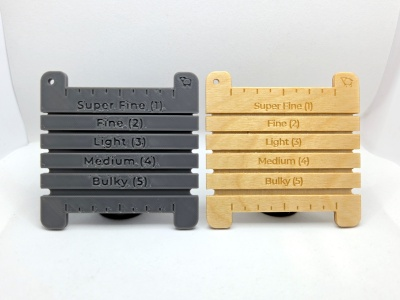
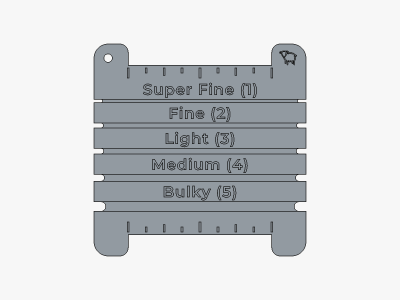
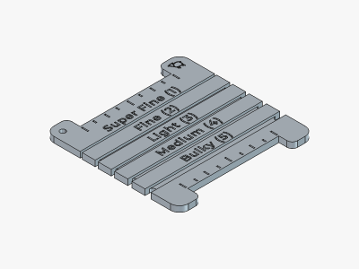
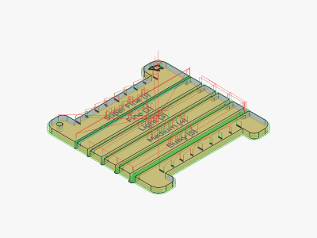

# Yarn Gauge

<table>
<tr>
<td></td>
<td></td>
</tr>
<tr>
<td></td>
<td></td>
</tr>
</table>

A 3D printable and CNC machineable yarn gauge with five gauge slots and 2 inch ruler for measuring WPIs. Gauge labels use category names from [Standard Yarn Weight System by Craft Yarn Council](https://www.craftyarncouncil.com/standards/yarn-weight-system). Made with FreeCAD.

Gauge labels and widths can be adjusted in the "Parameters" spreadsheet of the project file.

**Design (FDM):** [yarn-gauge.fdm.FCStd](yarn-gauge.fdm.FCStd)

**Design (CNC):** [yarn-gauge.cnc.FCStd](yarn-gauge.cnc.FCStd)

**STL:** [yarn-gauge.stl](stl/yarn-gauge.stl)

**Recommended Print Settings:** 0.20mm layer height, 100% infill, no supports, PLA/PLA+. For better surface text, try 25% infill/perimeters overlap and classic perimeter generator.

**CNC Stock and Tools:** 1/8" (3.175mm) wood stock, 60° V-bit (engraving), 1/32" endmill, 1/16" endmill. See project file for more details.

**Printables:** https://www.printables.com/model/1806006-yarn-gauge

**Thingiverse:** https://www.thingiverse.com/thing:7394002

**License**: 

Sheep SVG from https://www.svgrepo.com/svg/172567/sheep (CC0 License).
